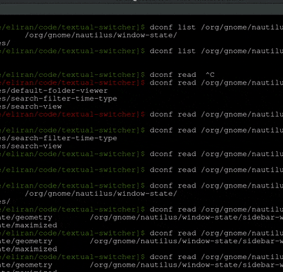

# Textual Switcher

An incremental search window switcher (text-based alternative for Alt+Tab). Lists windows and browser tabs.

Supported only on Linux with GNOME3-based window systems (GNOME3, Ubuntu Unity, Cinnamon).

## Demo


## Usage
Hit Ctrl+Alt+W to show the window, type some keyword to filter windows or browser tabs by titles, and hit Enter.

## Installation

Installation includes 3 parts:
* The switcher itself
* A firefox extnesion to support listing Firefox tabs
* A chrome extension to support listing Chrome tabs

### How to install
```
$ git clone https://github.com/levioctl/textual-switcher/
$ cd textua-switcher
$ make install
```
